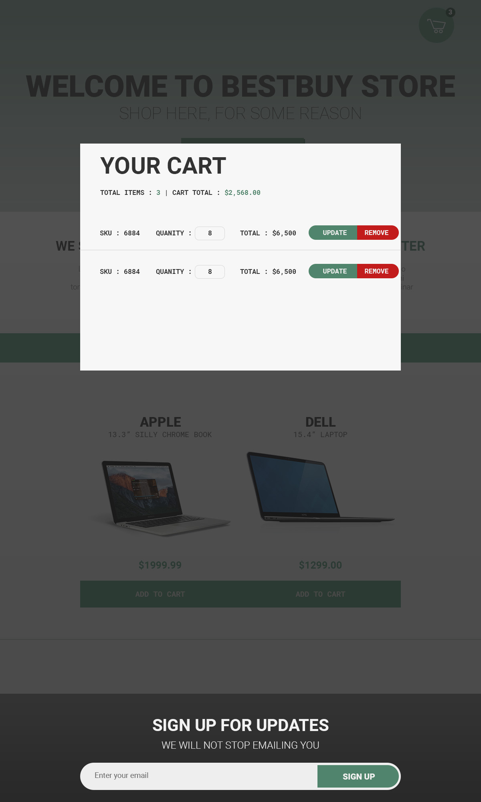

# BestBuy-ShoppingCart
Display product using Best Buy API.
Inspiration: https://github.com/philipduan/BestBuy-Project

Download folder
```bash
$npm install 
$gulp 
```
## Desktop
 

## Technologies Used
```bash
* HTML5 
* CSS3 (Flexbox, media queries)
* SCSS (variables, @mixins, @extends, partials)
* JavaScript 
* JQuery
* AJAX
* API's
* Mobile first approach to coding & design (RWD)
* Gulp
* BxSlider
```
